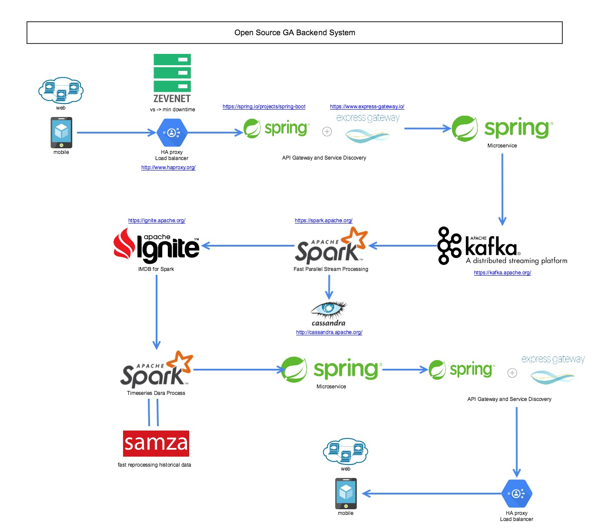

# GA Backend System Design

> How to handle billions write event?
> How to improve performance of distributed workload?
> How to handle a request by invoking multiple microservices and aggregating the results?
> Data collection limit to process latency.
> How to run min downtime?
> Reprocess historical data.

## Design Flow Chart

## Components
### Microservices
1. On a different platform, using different programming languages and developer tools
2. Teams can develop, maintain, and deploy each microservice independently.
3. Reduce the time to market and speed up CI/CD pipeline

### HAproxy/ZEVENET
1. Event Driven Architecture for Improved Performance.
2. Allows Zero-Downtime Maintenance. 
3. Supports Traffic Encryption & SSL Termination. 
4. Several Load Balancing Algorithms/Configurations. 
5. Access to Integrated Server Monitoring Dashboard. 
6. Optimized HTTP Header Analysis.

### Stream Process
A type of data processing engine that is designed with infinite data sets in mind. 

* Spark is popular 

   * High throughput, good for many use cases where sub-latency is not required.
   * Fault tolerance by default due to micro-batch nature.
   * imple to use higher level APIs.

* Samza can reprocess historical data quickly

   * Very good in maintaining large states of information.
   * Fault Tolerant and High performant.
